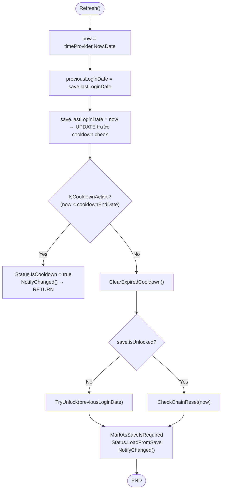
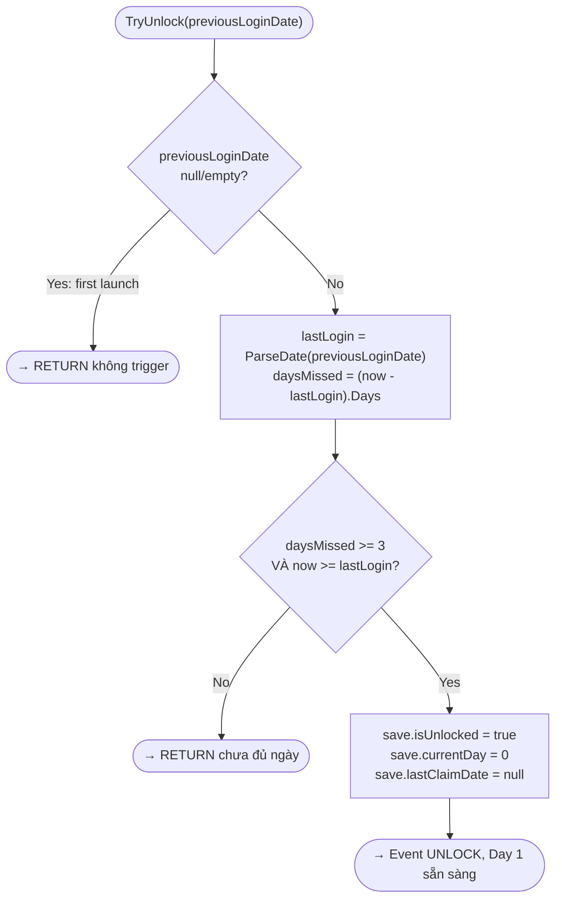
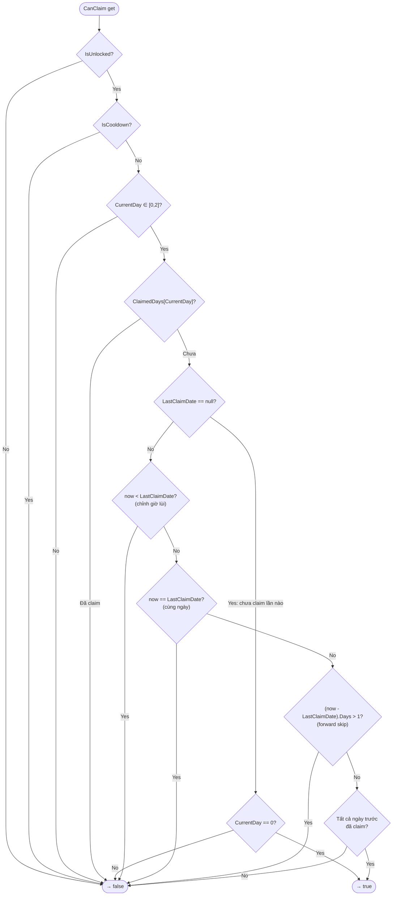
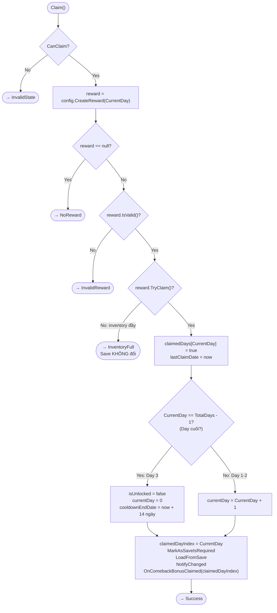
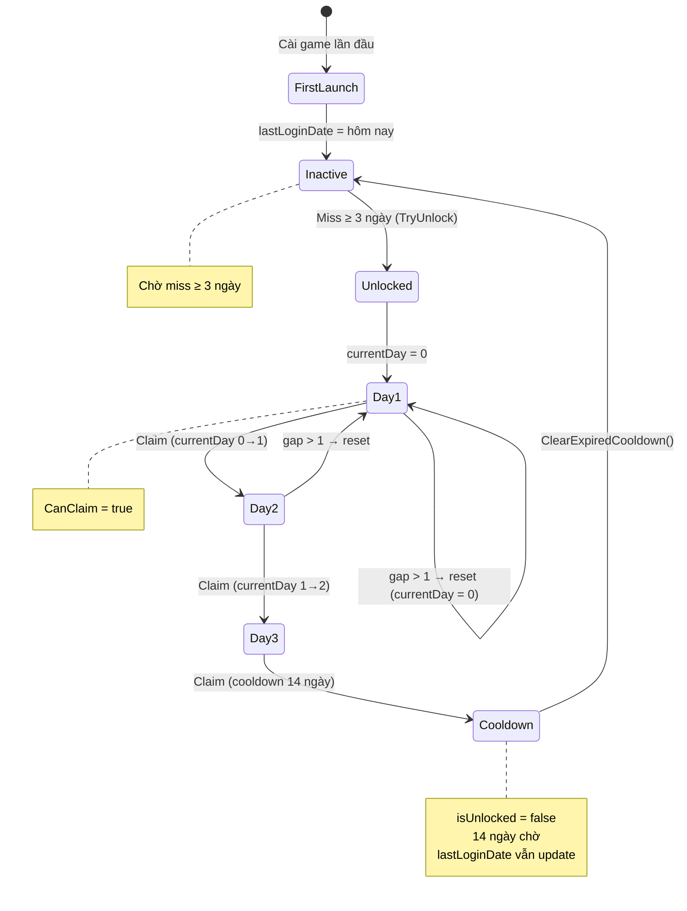

# Comeback Bonus — Chuẩn Bị Phỏng Vấn Vòng 2

> **Vị trí:** Unity Developer – LiveOps Event  
> **Vòng 2:** On-site Pair-code Interview (60 phút)  
> **Cấu trúc:** Walk-through 10' + Code Review 15' + Whiteboard 10' + Culture 25'

---

## Quick-Reference

| Thuật ngữ | Giá trị |
|---|---|
| `currentDay` | 0-indexed: 0 = Day 1, 1 = Day 2, 2 = Day 3 |
| Ngày format | `"yyyy-MM-dd"`, lưu string trong save |
| Ngày reset | 00:00 theo giờ máy player (`.Date` strip time) |
| Anti-cheat 3 lớp | Date-only → Forward `gap > 1` reset → Backward `now < last` block |
| Save key | `"ComebackBonus"` |
| Save version | `saveVersion = 1`, forward-only |
| Chain reset | `currentDay = 0, claimedDays = [F,F,F], lastClaimDate = null` |
| Cooldown | 14 ngày sau Day 3, check `now.Date >= endDate.Date` thì clear |
| Event claim | `OnComebackBonusClaimed(int dayIndex)` — fire **trước** khi advance |
| Event UI | `OnStatusChanged(ComebackBonusStatus)` — fire mỗi Refresh/Claim |
| Config | `ScriptableObject` → menu `LiveOps/Comeback Bonus` |
| Inventory full | `ClaimResult.InventoryFull` — save KHÔNG thay đổi, player thử lại |

---

## Mục Lục

- [Flow Diagrams](#flow-diagrams)
- [Phần 2A: Code Walk-through (15 câu)](#phần-2a-code-walk-through)
- [Phần 2B: Code Review tìm bug (8 câu)](#phần-2b-code-review-tìm-bug)
- [Phần 2C: Algorithm Whiteboard (10 câu)](#phần-2c-algorithm-whiteboard)
- [Phần 2D: Code Implementation (6 câu)](#phần-2d-code-implementation)
- [Phần 2E: System Design & Architecture (8 câu)](#phần-2e-system-design--architecture)
- [Phần 2F: Debug & Troubleshooting (6 câu)](#phần-2f-debug--troubleshooting)
- [Phần 2G: Culture & Experience (6 câu)](#phần-2g-culture--experience)

---

## Flow Diagrams

### Refresh() — Flow chính



### TryUnlock — Kích hoạt event



### CanClaim — 7 tầng validate



### Claim() — Nhận quà



### State Machine tổng thể



---

## Phần 2A: Code Walk-through

### Câu 1: Walk me qua `Refresh()` từng bước

**Hỏi:** *"Walk me through ComebackBonusController.Refresh() từng bước – em chọn thứ tự này tại sao?"*

**Trả lời:**

```
Bước 1: var now = timeProvider.Now.Date
        → Lấy ngày hiện tại, strip time (00:00:00)

Bước 2: var previousLoginDate = save.lastLoginDate
        → Cứu giá trị cũ TRƯỚC khi ghi đè

Bước 3: save.lastLoginDate = now.ToString("yyyy-MM-dd")
        → Update ngay login date (dùng ở cache cho lần Refresh sau)

Bước 4: if (IsCooldownActive(now)) → bail early
        → Nếu đang cooldown: set IsCooldown = true, notify, RETURN
        → Lưu ý: lastLoginDate đã update ở bước 3

Bước 5: ClearExpiredCooldown()
        → Nếu cooldownEndDate <= now: clear state về inactive

Bước 6: if (!save.isUnlocked) TryUnlock(previousLoginDate)
        → Dùng previousLoginDate (bước 2) để tính gap chính xác
        → Nếu dùng save.lastLoginDate (đã ghi đè bước 3) gap luôn = 0

Bước 7: else CheckChainReset(now)
        → Nếu đã unlock: kiểm tra miss ngày trong chuỗi

Bước 8: MarkAsSaveIsRequired(); LoadFromSave; NotifyChanged()
        → Đồng bộ runtime state + notify UI
```

**Tại sao thứ tự này?**
- `previousLoginDate` phải lưu TRƯỚC khi ghi đè — nếu không TryUnlock tính gap = 0
- `lastLoginDate` update trước cooldown check — trong cooldown vẫn update login date → sau hết cooldown, gap = 1 → cần miss thêm 3 ngày mới trigger lại (đây là design choice)
- Chain reset TRƯỚC khi UI render — UI luôn thấy state mới nhất

---

### Câu 2: Tại sao dùng string thay DateTime trong save?

**Hỏi:** *"Tại sao em dùng string (yyyy-MM-dd) thay vì DateTime?"*

**Trả lời:**

3 lý do:

1. **Serialization consistency:** Unity JSON (`JsonUtility`) serialize `DateTime` khác nhau tuỳ locale. String `"2026-05-10"` deterministic — luôn parse đúng trên mọi thiết bị.

2. **Null semantics:** `string` có thể null/empty → dễ phân biệt "chưa có giá trị" vs "có giá trị". `DateTime` là struct (không null được, phải dùng `DateTime?`).

3. **Migration friendly:** Thêm field mới → default null/empty → check `string.IsNullOrEmpty()` → an toàn. `DateTime` default = `0001-01-01` → dễ nhầm với data thật.

---

### Câu 3: Anti-cheat approach

**Hỏi:** *"Cách em chống cheat chỉnh giờ máy – giải thích approach."*

**Trả lời:**

3 lớp bảo vệ:

**Lớp 1 — Date-only comparison** (`Controller.cs:79,133`):
```csharp
var now = timeProvider.Now.Date;  // Strip time, chỉ so sánh ngày
```
Player không bypass bằng cách claim 23:59 → chỉnh 1 phút → claim lại 00:00 cùng ngày.

**Lớp 2 — Forward detection** (`Controller.cs:265-276`):
```csharp
if ((now - lastClaim).Days > 1) {
    // Reset chain về Day 1
}
```
Player chỉnh giờ tới → gap > 1 → chain reset. Skip càng xa, reset càng nhiều. Không có lợi ích.

**Lớp 3 — Backward detection** (`Controller.cs:138-139`):
```csharp
if (now < Status.LastClaimDate.Value) return false;
```
Player chỉnh giờ lùi → không claim lại được, NHƯNG `claimedDays` giữ nguyên. Fair với player vô tình chỉnh nhầm giờ.

**Tại sao không dùng server timestamp?** Game offline-first. `ITimeProvider` cho phép inject server time sau này khi có network.

---

### Câu 4: OnComebackBonusClaimed fire với dayIndex nào?

**Hỏi:** *"Trong Claim(), em fire event với dayIndex bao nhiêu? Tại sao?"*

**Trả lời:**

```csharp
var claimedDayIndex = Status.CurrentDay;  // Capture TRƯỚC LoadFromSave

// ... update save ...
save.currentDay = Status.CurrentDay + 1;  // Advance
// ... 
Status.LoadFromSave(save);  // Reload → CurrentDay = giá trị MỚI

OnComebackBonusClaimed?.Invoke(claimedDayIndex);  // Fire với giá trị CŨ
```

Nếu fire với `Status.CurrentDay` sau `LoadFromSave`: Claim Day 1 → `CurrentDay` đã = 1 → fire `dayIndex = 1` (SAI). Missions system nhận sai index → track sai.

Luôn capture **trước** reload, fire với **pre-update** value.

---

### Câu 5: Tại sao CanClaim check `Days > 1` không phải `>= 1`?

**Hỏi:** *"CanClaim check `(now - lastClaimDate).Days > 1`. Tại sao `>= 1`?"*

**Trả lời:**

`(now - lastClaim).Days` tính số NGUYÊN ngày giữa 2 dates:

| Kịch bản | Gap | `> 1` | `>= 1` |
|----------|-----|-------|---------|
| Claim hôm nay, vào lại hôm nay | 0 | false ✅ | false ✅ |
| Claim hôm qua, vào hôm nay | 1 | false ✅ claim được | true ❌ bị block |
| Claim 2 ngày trước, vào hôm nay | 2 | true ✅ reset | true ✅ reset |

`> 1` cho phép claim ngày tiếp theo (gap = 1). `>= 1` sẽ block claim ngày tiếp theo — sai spec.

---

### Câu 6: Chain reset khác gì cooldown?

| | Chain Reset | Cooldown |
|---|---|---|
| **Trigger** | Miss 1 ngày trong chuỗi (gap > 1) | Hoàn thành Day 3 |
| **isUnlocked** | `true` (vẫn unlock) | `false` (đã đóng) |
| **currentDay** | Về 0 | Về 0 |
| **claimedDays** | `[F,F,F]` | `[F,F,F]` |
| **Claim được?** | Có (từ Day 1 lại) | Không |
| **Thời gian** | Ngay lập tức | 14 ngày |
| **Ý nghĩa** | "Bắt đầu lại" | "Nghỉ ngơi" |

---

### Câu 7: Singleton — ưu/nhược

**Ưu:**
- Global access: UI bất kỳ đâu cũng subscribe `OnStatusChanged`
- Pattern consistency: `SampleEventController` cũng dùng singleton
- Đơn giản cho LiveOps event (chỉ cần 1 instance)

**Nhược:**
- Test khó: cần `Reset()` giữa các test → dễ quên → test flaky
- Tight coupling: hard dependency, khó thay thế implementation
- Scene reload: instance cũ vẫn còn nếu không cleanup

**Cách tránh bug trong code:**
```csharp
public static void Reset() {
    OnStatusChanged = null;           // Clear delegate references
    OnComebackBonusClaimed = null;    // Tránh memory leak
    Instance = null;
}
```
Gọi `Reset()` trong `[SetUp]` mỗi test. Clear events để không leak giữa tests.

---

### Câu 8: Bỏ lỡ ngày nhưng chưa claim lần nào — có reset không?

Không. `CheckChainReset` check null trước:
```csharp
if (string.IsNullOrEmpty(save.lastClaimDate)) return;  // Chưa claim → bỏ qua
```
Player chưa claim lần nào → `lastClaimDate = null` → không reset → Day 1 vẫn claimable.

**Hợp lý:** Chưa bắt đầu chuỗi → không có gì để reset.

---

### Câu 9: Hệ quả của việc update `lastLoginDate` trước cooldown check?

**Hỏi:** *"Code em update lastLoginDate trước cooldown check — có hệ quả gì?"*

**Trả lời:**

Đúng, code update `lastLoginDate` trước cooldown check:
```csharp
save.lastLoginDate = now.ToString("yyyy-MM-dd");  // Bước 3
if (IsCooldownActive(now)) { ... return; }         // Bước 4
```

**Hệ quả:**
- Trong 14 ngày cooldown, mỗi lần player mở game → `Refresh()` update `lastLoginDate` = hôm nay
- Sau khi hết cooldown: `previousLoginDate` = hôm qua (vì vừa update)
- `TryUnlock` tính `gap = (today - yesterday).Days = 1` → **không trigger**
- Player phải **miss thêm 3 ngày** nữa mới trigger lại event

**Đây là design choice** của em vì:
1. PRD nói "cooldown 14 ngày trước khi CÓ THỂ trigger lại" — không hứa trigger ngay
2. Giữ nguyên behavior cũ an toàn cho production
3. Nếu muốn trigger ngay: move update `lastLoginDate` xuống sau cooldown check

---

### Câu 10: Uninstall rồi reinstall — chuyện gì xảy ra?

**Hỏi:** *"Player claim Day 1 → uninstall → reinstall 1 tháng sau → event có trigger không?"*

**Trả lời:**

Save local bị mất khi uninstall:
1. `MockSaveController.GetSaveObject` tạo save MỚI (default fields)
2. `lastLoginDate = null` → `IsFirstLaunch = true`
3. `TryUnlock` thấy `previousLoginDate = null` → return early, không trigger
4. `lastLoginDate` được set = today
5. Player cần miss ≥ 3 ngày kể từ hôm nay mới trigger

**Vấn đề:** Player mất toàn bộ progress. Đây là hạn chế của local save. Nếu cần chống, phải dùng server save (PlayerPrefs cloud, Firebase, ...).

---

### Câu 11: Serialization — tại sao không dùng Unix timestamp?

**Hỏi:** *"Sao không dùng `long` Unix timestamp thay vì `string` date?"*

**Trả lời:**

| | ISO string `yyyy-MM-dd` | Unix timestamp (`long`) |
|---|---|---|
| **Debug readable** | `"2026-05-10"` — đọc ngay | `1778390400` — phải convert |
| **Null state** | `null` hoặc `""` — rõ ràng | `0` hoặc `-1` — ambiguous |
| **Migration** | Check `string.IsNullOrEmpty()` | Check giá trị cụ thể |
| **Timezone** | Không phụ thuộc vị trí | Phụ thuộc epoch definition |
| **Date comparison** | Parse rồi `.Date` — đơn giản | Phải convert rồi compare |

Game offline-first ưu tiên readability + null-safety → string phù hợp hơn.

---

### Câu 12: InventoryFull — UI xử lý thế nào?

**Hỏi:** *"Khi ClaimResult.InventoryFull, em suggest UI xử lý ra sao?"*

**Trả lời:**

1. Controller trả về `ClaimResult.InventoryFull`
2. UI hiển thị popup: "Inventory is full! Free up space to claim."
3. Popup có 1 nút "OK" → dismiss
4. Không auto-retry — tránh infinite loop
5. `CanClaim` vẫn `true` (cùng ngày) → player dọn inventory → claim lại

**Code UI gợi ý:**
```csharp
void OnClaimButtonClicked() {
    var result = controller.Claim();
    switch (result) {
        case ClaimResult.Success: ShowRewardAnimation(); break;
        case ClaimResult.InventoryFull: ShowPopup("Inventory full!"); break;
        case ClaimResult.InvalidState: break; // Button shouldn't be visible
    }
}
```

---

### Câu 13: Save migration — thêm field mới

**Hỏi:** *"Nếu sau này thêm field `claimExactTime` (DateTime) — em migrate thế nào?"*

**Trả lời:**

```csharp
// Step 1: Thêm field mới vào ComebackBonusSave
public class ComebackBonusSave : ISaveObject {
    public int saveVersion = 2;  // Bump version
    public string claimExactTime; // ISO 8601 format, mới
    // ... existing fields
}

// Step 2: Migration logic
private void MigrateSave(ComebackBonusSave save) {
    if (save.saveVersion < 1) {
        save.claimedDays ??= new bool[3];
        save.saveVersion = 1;
    }
    if (save.saveVersion < 2) {
        save.claimExactTime = null;  // null = chưa có data
        save.saveVersion = 2;
    }
}

// Step 3: Null-safe access
DateTime? GetClaimExactTime() {
    if (string.IsNullOrEmpty(save.claimExactTime)) return null;
    return DateTime.ParseExact(save.claimExactTime, "yyyy-MM-dd", CultureInfo.InvariantCulture);
}
```

**Nguyên tắc:** Forward-only, null-safe, không xoá field cũ.

---

### Câu 14: Designer đổi cooldownDays giữa phiên

**Hỏi:** *"Designer đổi config cooldownDays từ 14 → 7. Event đang cooldown cũ 14 ngày. Chuyện gì xảy ra?"*

**Trả lời:**

```csharp
// Save đã ghi cooldownEndDate với 14 ngày:
save.cooldownEndDate = now.AddDays(14).ToString("yyyy-MM-dd");

// Config đã load vào RAM, không tự động refresh
// Check cooldown vẫn dùng giá trị trong save:
IsCooldownActive(now) => now < endDate  // endDate vẫn là +14 ngày
```

**Player cũ vẫn chịu cooldown 14 ngày** dù config mới = 7. Không tự động giảm.

**Fix nếu cần:** Thêm method `ApplyCooldownConfigChange()`:
```csharp
void ApplyCooldownConfigChange() {
    if (!string.IsNullOrEmpty(save.cooldownEndDate)) {
        var remaining = (ParseDate(save.cooldownEndDate) - timeProvider.Now.Date).Days;
        if (config.CooldownDays < remaining) {
            // Config mới ngắn hơn → giảm cooldown
            save.cooldownEndDate = timeProvider.Now.Date.AddDays(config.CooldownDays).ToString(DATE_FORMAT);
        }
        // Config mới dài hơn → giữ nguyên (do not harm)
    }
}
```

---

### Câu 15: OnComebackBonusClaimed fire với dayIndex nào?

(Như Câu 4, đã trả lời ở trên)

---

## Phần 2B: Code Review tìm bug

### Bug 1: Static events không cleanup trong Reset()

**Code có vấn đề:**
```csharp
public static void Reset() {
    Instance = null;  // Chỉ null Instance, events vẫn còn!
}
```

**Vấn đề:** `OnStatusChanged` và `OnComebackBonusClaimed` là static events. Nếu test A subscribe → `Reset()` chỉ null Instance → test B init → event cũ từ test A vẫn fire → **test flaky** + **memory leak**.

**Fix của em:**
```csharp
public static void Reset() {
    OnStatusChanged = null;
    OnComebackBonusClaimed = null;
    Instance = null;
}
```

---

### Bug 2: Refresh() update lastLoginDate trước cooldown check

**Code:**
```csharp
public void Refresh() {
    save.lastLoginDate = now.ToString("yyyy-MM-dd");  // Update TRƯỚC
    if (IsCooldownActive(now)) { ... return; }          // Check SAU
}
```

**Vấn đề:** Trong cooldown, `lastLoginDate` bị update mỗi ngày → sau hết cooldown, gap = 1 → event **không trigger lại** nếu player login daily.

**Fix:** Move `save.lastLoginDate` update xuống sau cooldown check. Hoặc giữ nguyên nếu đó là intended behavior (player cần miss thêm 3 ngày sau cooldown).

---

### Bug 3: Parse date không null-check

**Code có vấn đề (nếu thiếu check):**
```csharp
var lastLogin = DateTime.Parse(save.lastLoginDate);  // null → ArgumentNullException
```

**Code của em đã handle:**
```csharp
if (string.IsNullOrEmpty(previousLoginDate)) return;
var lastLogin = ParseDate(previousLoginDate);
```
Null check trước khi parse → an toàn cho first-launch player.

---

### Bug 4: Fire sai dayIndex

**Code SAI (nếu không capture trước):**
```csharp
Status.LoadFromSave(save);
OnComebackBonusClaimed?.Invoke(Status.CurrentDay);  // SAI! Đã advance
```

Claim Day 1 → `Status.CurrentDay` = 1 → fire `dayIndex = 1` (SAI, phải là 0).

**Code của em ĐÚNG:**
```csharp
var claimedDayIndex = Status.CurrentDay;  // Capture TRƯỚC
// ... update save, LoadFromSave ...
OnComebackBonusClaimed?.Invoke(claimedDayIndex);  // Fire giá trị cũ
```

---

### Bug 5: CanClaim thiếu bounds check

**Code có vấn đề (nếu thiếu):**
```csharp
if (Status.ClaimedDays[Status.CurrentDay]) return false;
// Nếu CurrentDay = -1 hoặc 3 → IndexOutOfRangeException
```

**Code của em ĐÚNG:**
```csharp
if (Status.CurrentDay < 0 || Status.CurrentDay > 2) return false;  // Bounds check
if (Status.ClaimedDays[Status.CurrentDay]) return false;
```

---

### Bug 6: ClearExpiredCooldown reset không đồng bộ

**Code có vấn đề (nếu thiếu):**
```csharp
private void ClearExpiredCooldown() {
    save.cooldownEndDate = null;
    save.isUnlocked = false;
    save.claimedDays = new bool[3];
    // Quên: save.currentDay = 0;
    // Quên: save.lastClaimDate = null;
}
```

Nếu quên reset `currentDay`: `ClaimedDays[2]` = false → cho claim Day 3 sai (đang inactive).

**Code của em ĐÚNG:** Reset đầy đủ `currentDay`, `claimedDays`, `lastClaimDate`.

---

### Bug 7: Quên MarkAsSaveIsRequired

**Code có vấn đề (nếu thiếu):**
```csharp
ClearState();  // Thay đổi save nhưng KHÔNG gọi MarkAsSaveIsRequired
```

Save thay đổi trong memory nhưng không persist. Restart → mất hết. Player stuck cooldown vĩnh viễn.

**Code của em:** Gọi `MarkAsSaveIsRequired()` sau mỗi state change.

---

### Bug 8: CanClaim thiếu check claim thứ tự

**Code có vấn đề (nếu thiếu):**
```csharp
// Không check Day 1 đã claim trước khi claim Day 2
if (Status.ClaimedDays[Status.CurrentDay]) return false;
```

Player claim Day 2 mà chưa claim Day 1.

**Code của em ĐÚNG:**
```csharp
for (int i = 0; i < Status.CurrentDay; i++)
    if (!Status.ClaimedDays[i]) return false;
```

---

## Phần 2C: Algorithm Whiteboard

### Whiteboard 1: IsTimeCheating

```
enum CheatType { None, Forward, Backward }

bool IsTimeCheating(DateTime savedDate, DateTime currentDate, out CheatType type) {
    type = CheatType.None;
    if (savedDate == default) return false;

    var saved = savedDate.Date;
    var current = currentDate.Date;

    // Backward: chỉnh giờ lùi
    if (current < saved) {
        type = CheatType.Backward;
        return true;
    }
    // Forward: skip ngày > 1
    if ((current - saved).Days > 1) {
        type = CheatType.Forward;
        return true;
    }
    return false;
}
```

---

### Whiteboard 2: ShouldResetChain

```
bool ShouldResetChain(DateTime? lastClaimDate, DateTime now) {
    if (lastClaimDate == null) return false;      // Chưa claim → không reset
    if (now.Date < lastClaimDate.Value.Date) return false;  // Backward → giữ progress
    return (now.Date - lastClaimDate.Value.Date).Days > 1; // Forward > 1 → reset
}
```

---

### Whiteboard 3: CalculateMissedChainDays

```
int CalculateMissedChainDays(DateTime[] claimDates, DateTime now) {
    if (claimDates == null || claimDates.Length == 0) return 0;
    Array.Sort(claimDates);
    var lastClaim = claimDates[claimDates.Length - 1].Date;
    var gap = (now.Date - lastClaim).Days;
    if (gap <= 1) return 0;
    return gap - 1;  // Miss = gap - 1
}
```

**Ví dụ:** Claim May 10, now May 13 → gap = 3 → miss = 2 (May 11, 12)

---

### Whiteboard 4: GetAvailableDay

```
int GetAvailableDay(bool[] claimed, int currentDay, DateTime? lastClaim, DateTime now) {
    for (int i = 0; i < 3; i++) {
        if (!claimed[i]) {
            if (i == 0) return 0;                      // Day 1 luôn available nếu unlock
            if (lastClaim == null) return i;             // Không có data → cho claim
            if (now.Date < lastClaim.Value.Date) return -1;  // Backward
            if (now.Date == lastClaim.Value.Date) return -1;  // Cùng ngày
            if ((now.Date - lastClaim.Value.Date).Days > 1) return -1; // Forward
            return i;
        }
    }
    return -1;  // Tất cả đã claim
}
```

---

### Whiteboard 5: CalculateCooldownEnd

```
DateTime CalculateCooldownEnd(DateTime completeDate, int cooldownDays, HashSet<DateTime> blackoutDates) {
    var current = completeDate.Date;
    var remaining = cooldownDays;
    while (remaining > 0) {
        current = current.AddDays(1);
        if (blackoutDates != null && blackoutDates.Contains(current))
            continue;  // Skip blackout (maintenance)
        remaining--;
    }
    return current;
}
```

**Ví dụ:** complete = May 10, cooldown = 3, blackout = [May 12]  
→ May 11 (1) → May 12 skip → May 13 (2) → May 14 (0) → return May 14

---

### Whiteboard 6: DetectAndHandleTimeManipulation

```
enum ManipulationType { None, Forward, Backward }

ManipulationType DetectAndHandle(DateTime? lastClaimDate, DateTime now, out string message) {
    message = null;
    if (lastClaimDate == null) return ManipulationType.None;

    var lastClaim = lastClaimDate.Value.Date;
    var current = now.Date;

    if (current < lastClaim) {
        message = "Thiết bị bị chỉnh giờ lùi. Claim bị khóa, progress được giữ.";
        return ManipulationType.Backward;
    }

    var gap = (current - lastClaim).Days;
    if (gap > 1) {
        // Chain reset
        message = "Bỏ lỡ " + (gap - 1) + " ngày. Chain reset về Day 1.";
        return ManipulationType.Forward;
    }

    return ManipulationType.None;
}
```

---

### Whiteboard 7: IsFirstValidLaunch

```
bool IsFirstValidLaunch(string lastLoginDate) {
    if (string.IsNullOrEmpty(lastLoginDate)) return true;
    try {
        DateTime.ParseExact(lastLoginDate, "yyyy-MM-dd", CultureInfo.InvariantCulture);
        return false;  // Đã từng login
    } catch {
        return true;   // Data corrupt → treat as first launch
    }
}
```

---

### Whiteboard 8: CanClaimDay (check ngày cụ thể)

```
bool CanClaimDay(int dayIndex, ComebackBonusStatus status, ITimeProvider time) {
    if (!status.IsUnlocked) return false;
    if (status.IsCooldown) return false;
    if (dayIndex < 0 || dayIndex > 2) return false;
    if (status.ClaimedDays[dayIndex]) return false;
    
    // Phải claim tuần tự
    for (int i = 0; i < dayIndex; i++)
        if (!status.ClaimedDays[i]) return false;
    
    // Time check
    var now = time.Now.Date;
    if (status.LastClaimDate == null) return dayIndex == 0;
    if (now < status.LastClaimDate.Value) return false;  // Backward
    if (now == status.LastClaimDate.Value) return false;  // Cùng ngày
    if ((now - status.LastClaimDate.Value).Days > 1) return false;  // Forward
    
    return true;
}
```

---

### Whiteboard 9: CalculateNextCooldownEnd

```
DateTime CalculateNextCooldownEnd(DateTime now, int cooldownDays, int totalDays) {
    // Nếu claim liên tục:
    // Day 1: hôm nay, Day 2: hôm nay+1, Day 3: hôm nay+2
    // Cooldown start: hôm nay + (totalDays - 1)
    // Cooldown end: start + cooldownDays
    var chainCompleteDate = now.Date.AddDays(totalDays - 1);
    return chainCompleteDate.AddDays(cooldownDays);
}
```

**Ví dụ:** now = May 10, totalDays = 3, cooldown = 14  
→ Chain complete = May 12 → Cooldown end = May 26

---

### Whiteboard 10: MergeOldSave (migration)

```
void MergeOldSave(ComebackBonusSave save, int targetVersion) {
    while (save.saveVersion < targetVersion) {
        switch (save.saveVersion) {
            case 0:
                save.claimedDays ??= new bool[3];
                save.lastClaimDate ??= null;
                save.lastLoginDate ??= null;
                save.cooldownEndDate ??= null;
                save.saveVersion = 1;
                break;
            case 1:
                save.claimExactTime ??= null;  // New field
                save.saveVersion = 2;
                break;
            default:
                throw new Exception("Unknown version: " + save.saveVersion);
        }
    }
}
```

---

## Phần 2D: Code Implementation

### Implement 1: Thêm OnComebackBonusCooldownStarted event

```csharp
// Khai báo event
public static event Action<int> OnComebackBonusCooldownStarted;

// Fire trong Claim(), sau khi set cooldown:
if (Status.CurrentDay == config.TotalDays - 1) {
    save.cooldownEndDate = now.AddDays(config.CooldownDays).ToString(DATE_FORMAT);
    OnComebackBonusCooldownStarted?.Invoke(config.CooldownDays);
}

// UI subscribe:
ComebackBonusController.OnComebackBonusCooldownStarted += (days) => {
    ShowCooldownPopup(days);
};

// Remind: clear trong Reset()
public static void Reset() {
    OnComebackBonusCooldownStarted = null;
    OnStatusChanged = null;
    OnComebackBonusClaimed = null;
    Instance = null;
}
```

---

### Implement 2: ForceEndEvent cho GM Tools

```csharp
public void ForceEndEvent() {
    save.isUnlocked = false;
    save.currentDay = 0;
    save.claimedDays = new bool[3];
    save.lastClaimDate = null;
    save.cooldownEndDate = null;
    save.lastLoginDate = timeProvider.Now.Date.ToString(DATE_FORMAT);
    MockSaveController.MarkAsSaveIsRequired();
    Status.LoadFromSave(save);
    NotifyChanged();
}
```

---

### Implement 3: Cache lastLoginDate để tránh parse

```csharp
private DateTime _cachedLastLoginDate;
private bool _hasCachedLastLogin;

public void Refresh() {
    if (!_hasCachedLastLogin && !string.IsNullOrEmpty(save.lastLoginDate)) {
        _cachedLastLoginDate = ParseDate(save.lastLoginDate);
        _hasCachedLastLogin = true;
    }
    // Dùng _cachedLastLoginDate thay vì parse mỗi lần
}

private void InvalidateCache() {
    _hasCachedLastLogin = false;
}
```

---

### Implement 4: Write-ahead logging cho claim

```csharp
public ClaimResult Claim() {
    if (!CanClaim) return ClaimResult.InvalidState;

    // 1. Write-ahead: ghi ý định claim TRƯỚC
    save.currentDay = Status.CurrentDay;
    MockSaveController.MarkAsSaveIsRequired();
    // save.Flush();  // Force persist ngay

    // 2. Apply reward
    var reward = config.CreateReward(Status.CurrentDay);
    if (!reward.TryClaim()) return ClaimResult.InventoryFull;

    // 3. Commit
    save.claimedDays[Status.CurrentDay] = true;
    save.lastClaimDate = timeProvider.Now.Date.ToString(DATE_FORMAT);
    // ... rest of commit
    return ClaimResult.Success;
}
```

Nếu crash giữa bước 1 và 3 → load lại thấy ý định claim → commit lại hoặc rollback.

---

### Implement 5: Thêm minSessionTime config

```csharp
// Config:
[SerializeField] private int minSessionTimeMinutes = 5;
public int MinSessionTimeMinutes => minSessionTimeMinutes;

// Controller:
private DateTime sessionStartTime;

public void Init(...) {
    sessionStartTime = timeProvider.Now;
    // ...
}

public bool CanClaim {
    get {
        // ... existing checks ...
        var sessionElapsed = (timeProvider.Now - sessionStartTime).TotalMinutes;
        if (sessionElapsed < config.MinSessionTimeMinutes) return false;
        return true;
    }
}
```

---

### Implement 6: Double Reward Weekend

```csharp
// Config:
[SerializeField] private bool doubleRewardWeekend = true;
[SerializeField] private DayOfWeek[] weekendDays = { DayOfWeek.Saturday, DayOfWeek.Sunday };

// Controller:
private bool IsWeekend() {
    return config.weekendDays.Contains(timeProvider.Now.DayOfWeek);
}

public IReward CreateReward(int dayIndex) {
    var baseReward = config.CreateReward(dayIndex);
    if (baseReward == null || !IsWeekend()) return baseReward;
    
    if (baseReward is CoinReward coin)
        return new CoinReward { amount = coin.amount * 2 };
    if (baseReward is BoosterReward booster)
        return new BoosterReward { boosterId = booster.boosterId, quantity = booster.quantity * 2 };
    return baseReward;
}
```

---

## Phần 2E: System Design & Architecture

### Design 1: Scale cho 20 event

```csharp
public interface IEventController {
    void Init(IConfig config, ITimeProvider time);
    void Refresh();
    IEventStatus Status { get; }
    event Action<IEventStatus> OnStatusChanged;
}

public static class EventFactory {
    public static IEventController Create(EventType type) => type switch {
        EventType.ComebackBonus => new ComebackBonusController(),
        EventType.HourlyGift => new HourlyGiftController(),
        _ => throw new ArgumentException()
    };
}

public class EventManager {
    private Dictionary<EventType, IEventController> events = new();
    public void Register(EventType type, IEventConfig config) {
        var ctrl = EventFactory.Create(type);
        ctrl.Init(config, new SystemTimeProvider());
        events[type] = ctrl;
    }
    public void RefreshAll() {
        foreach (var ev in events.Values) ev.Refresh();
    }
}
```

---

### Design 2: Anti-cheat với server support

```csharp
public class ServerTimeProvider : ITimeProvider {
    private long serverTimestampUtc;
    private DateTime _lastSyncTime;
    public DateTime Now {
        get {
            if (IsServerTimeValid())
                return DateTimeOffset.FromUnixTimeSeconds(serverTimestampUtc).LocalDateTime;
            return DateTime.Now;  // Fallback local
        }
    }
    private bool IsServerTimeValid() {
        return (DateTime.Now - _lastSyncTime).TotalMinutes < 10;
    }
}
```

Client gửi claim request: `{ dayIndex, lastClaimDate, claimedDays }` → Server verify timestamp → reject nếu mismatch.

---

### Design 3: Timezone player khác nhau

| Approach | Pros | Cons |
|----------|------|------|
| Local time (`DateTime.Now`) | Đơn giản, offline | Đổi timezone → reset sai |
| UTC offset | Nhất quán hơn | Phức tạp hơn |
| Server forced reset | Uniform cho tất cả player | Cần server |

**Khuyến nghị:** Game offline-first → dùng local time. Nếu có server → server forced reset.

---

### Design 4: Save size optimization (50 events)

| Format | 1 event | 50 events |
|--------|---------|-----------|
| JSON (hiện tại) | ~120 bytes | ~6 KB |
| Bitmask + Binary | ~40 bytes | ~2 KB |

`claimedDays bool[3]` → `claimedDaysMask int` (3 bits). Dùng `BinaryWriter` thay JSON.

---

### Design 5: Remote config (Firebase)

```csharp
public class RemoteConfigProvider {
    public void ApplyRemoteConfig(ComebackBonusConfig config) {
        var json = FirebaseRemoteConfig.GetString("comeback_bonus_config");
        if (string.IsNullOrEmpty(json)) return;
        var remote = JsonUtility.FromJson<ComebackBonusConfigRemote>(json);
        if (remote.minMissedDays > 0) config.MinMissedDays = remote.minMissedDays;
    }
}
```

Fallback: Local ScriptableObject → Remote Config → (fetch fail) → local.

---

### Design 6: Unit testing event infrastructure

```csharp
public class EventTestFixture {
    protected MockSaveController save;
    protected MockTimeProvider time;
    protected ComebackBonusConfig config;

    [SetUp]
    public virtual void Setup() {
        MockSaveController.Reset();
        ComebackBonusController.Reset();
        time = new MockTimeProvider { Now = new DateTime(2026, 5, 10) };
        config = ScriptableObject.CreateInstance<ComebackBonusConfig>();
    }
}
```

Key: DI (`ITimeProvider`), `Reset()` giữa tests, mock save controller.

---

### Design 7: Event config inheritance

```csharp
public abstract class BaseEventController {
    protected ITimeProvider timeProvider;
    public abstract void Refresh();
    public abstract bool CanClaim { get; }
    public abstract ClaimResult Claim();

    protected bool IsDateManipulated(DateTime? lastDate, DateTime now) {
        if (lastDate == null) return false;
        return now.Date < lastDate.Value.Date;
    }
}

public class ComebackBonusController : BaseEventController {
    // ...
}
```

Common logic (date manipulation, save) ở base class. Each event override `Refresh`, `Claim`.

---

### Design 8: Double claim prevention (crash scenario)

**Scenario:** Claim → app crash → chưa save → restart → claim lại → double reward.

**Solution — Write-ahead log:**
1. Ghi ý định claim vào save TRƯỚC (`PendingClaim`)
2. Apply reward
3. Nếu crash trước step 3 → load PendingClaim → commit lại hoặc rollback

---

## Phần 2F: Debug & Troubleshooting

### Debug 1: Event không unlock dù miss đúng 3 ngày

**Root cause:** `Refresh()` ghi đè `lastLoginDate` TRƯỚC khi TryUnlock.
```csharp
save.lastLoginDate = now.ToString("yyyy-MM-dd");  // Ghi đè
TryUnlock();  // Đọc save.lastLoginDate = today → gap = 0
```

**Fix:** Dùng `previousLoginDate` (cứu trước khi ghi đè).

---

### Debug 2: Claim Day 2 trước Day 1

**Root cause:** Thiếu check claim theo thứ tự trong `CanClaim`.

**Fix:** Thêm for loop:
```csharp
for (int i = 0; i < Status.CurrentDay; i++)
    if (!Status.ClaimedDays[i]) return false;
```

---

### Debug 3: Cooldown không kết thúc

**Debug checklist:**
1. Log `save.cooldownEndDate` → đúng format?
2. Log `now` → đúng ngày?
3. `ClearExpiredCooldown`: `now >= endDate` → true?
4. Nếu không clear: check `timeProvider.Now.Date` vs `DateTime.Now.Date`
5. Nếu clear nhưng Refresh vẫn cooldown: check `save.lastClaimDate` có null không

---

### Debug 4: Test flaky vì singleton

**Vấn đề:** `ComebackBonusController.Instance` còn từ test trước.

**Fix:** `[SetUp]` gọi `ComebackBonusController.Reset()` (đã clear events + null Instance).

---

### Debug 5: Player report "mất reward" sau claim

**Root cause 1:** Save chưa kịp flush → crash → mất.  
**Fix:** Write-ahead log.

**Root cause 2:** UI show reward animation TRƯỚC khi `TryClaim()` return.  
**Fix:** Claim trước, show animation sau.

**Root cause 3:** `CoinReward.TryClaim()` là stub → luôn return true dù chưa add wallet.  
**Fix:** Implement thực tế `CurrencyController.AddCoin()`.

---

### Debug 6: Production issue approach

1. **Triage (5')**: Severity? Bao nhiêu player affected? Crash hay wrong data?
2. **Investigate (15')**: Check logs, check save data, reproduce local
3. **Fix (10')**: Write failing test → fix → regression test
4. **Deploy (5')**: Hotfix branch → code review → merge → monitor
5. **Postmortem**: 5 whys, prevention, share with team

---

## Phần 2G: Culture & Experience

### Câu 1: Maintain event cũ — không break save?

- **Add, don't remove:** Thêm field mới, không xoá field cũ
- **Null-safe:** `??` operator, `string.IsNullOrEmpty()`, `try-catch` parse
- **Versioning:** `saveVersion` + migration chain forward-only
- **Feature flag:** Code mới đi sau flag, rollback dễ
- **Smoke test:** Load save cũ nhất → không crash

---

### Câu 2: Designer đổi spec mid-event?

1. **Impact analysis:** Reward future days → an toàn. Cooldown → ưu tiên có lợi cho player
2. **Communicate:** Confirm thay đổi không phá save
3. **Implement:** Hot-reload config nếu có, nếu không → player restart game
4. **Document:** Changelog "Why, What, When"

---

### Câu 3: A/B test event?

1. **Setup:** Config key riêng cho variant A/B, random assignment `playerId % 2`
2. **Metrics:** D1 retention rate, D3 completion rate, D7 retention
3. **Duration:** Tối thiểu 7 ngày, rollout winner khi confidence > 95%
4. **Pitfalls:** Sample ratio mismatch, novelty effect, segment bias

---

### Câu 4: AI tools trong LiveOps?

- **Dùng:** Generate unit test cho edge case, explain bug từ stack trace, find bugs trong code review
- **Không dùng cho:** Security-critical logic (reward calculation, anti-cheat), save migration, production hotfix
- **Quan trọng:** Review kỹ AI-generated code, understand mỗi dòng mình submit

---

### Câu 5: Học codebase cũ khi vào team mới?

1. **Day 1-2:** Read README, architecture docs, 1 event đang chạy (Config → Save → Status → Controller → Test)
2. **Day 3-4:** Set up local, chạy game, trigger event manually, debug step-by-step
3. **Day 5-7:** Pick 1 bug nhỏ → implement fix + test → code review với senior
4. **Week 2-3:** Pick 1 feature nhỏ → implement từ đầu → follow đúng pattern
5. **Always:** Ask questions, document what you learn, pair code

---

### Câu 6: Điểm mạnh/yếu của code mình?

**Điểm mạnh:**
- 3-layer anti-cheat rõ ràng (date-only, forward, backward)
- Null-safe everywhere (`??`, `IsNullOrEmpty`)
- Event fire đúng dayIndex (capture trước reload)
- Test coverage 13 tests (vượt yêu cầu 7)
- `ITimeProvider` inject cho test

**Điểm yếu:**
- `Refresh()` update `lastLoginDate` trước cooldown check → event không trigger lại ngay sau cooldown (design choice)
- Static events cần cleanup trong `Reset()` (đã fix)
- Stubs hardcode `TryClaim() = true` → không test được InventoryFull

---

*Chúc bạn phỏng vấn tốt! Mục tiêu: hiểu code mình viết, giải thích rõ tư duy, không cần trả lời đúng 100%.*